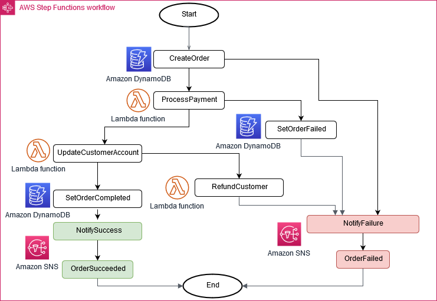

# saga-orders-step-functions

Padrão de projeto SAGA, usando AWS Step-Functions para manter a consistência dos dados em vários microsserviços, oferecendo transações de compensação em caso de falha.

Inspirado no exemplo proposto pela AWS, disponível em: https://docs.aws.amazon.com/prescriptive-guidance/latest/modernization-data-persistence/saga-pattern.html

Este é um projeto que usa Maven para gerenciar as dependências, Java 11 para lógica do programa fonte e AWS SDK para interagir com serviços AWS, sendo eles: API Gateway, AWS Lambda, Step-Functions, DynamoDB e Amazon SNS. 




## Construção e implantação
````
mvn clean package

aws s3 mb s3://saga-orders-step-functions

aws s3 cp target/sourceCode.zip s3://saga-orders-step-functions

sam deploy --s3-bucket saga-orders-step-functions --stack-name saga-pattern --capabilities CAPABILITY_IAM
````

## Testes
````
aws sns subscribe \
--topic-arn arn:aws:sns:eu-central-1:YOUR_AWS_ACCOUNT:NotifyFailure \
--protocol email \
--notification-endpoint YOUR_EMAIL@DOMAIN.com

aws sns subscribe \
--topic-arn arn:aws:sns:eu-central-1:YOUR_AWS_ACCOUNT:NotifySuccess \
--protocol email \
--notification-endpoint YOUR_EMAIL@DOMAIN.com
````

## Requisitando a API
````
curl -X POST https://API_GATEWAY_URL -H "Content-Type: application/json" -d '{"customerId": "aaaa-1111","amount": "19.99"}'
````

E então receberá um email informando: {"orderStatus":"Completed","payment":"Completed"}

Para simular os casos de falhas, deverá ser descomentado as instruções de exceção em PaymentHandler e FulFillHandler.

## Finalizando
````
aws cloudformation delete-stack --stack-name saga-pattern

aws s3 rm s3://saga-orders-step-functions --recursive

aws s3 rb s3://saga-orders-step-functions
````
